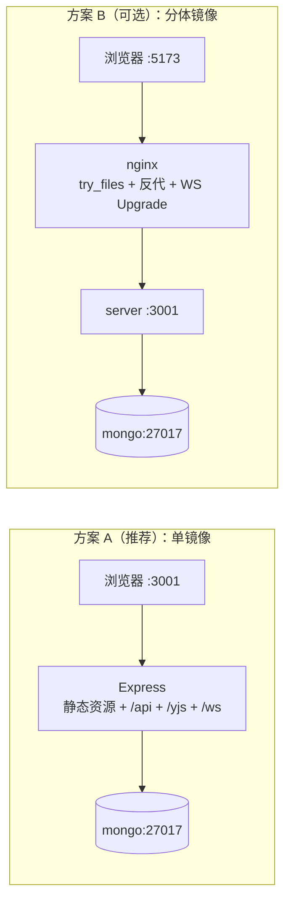

# 阶段三 Task 2：容器化与一键启动 — 详细实施计划

> **目标**：`docker compose up --build` 一条命令拉起 MongoDB + 应用，浏览器直接访问编辑器；`/health` 返回 200。
> **范围**：新增 Dockerfile / compose.yml / .dockerignore / `.env.example`，并修复阻断容器构建的既有问题。
> **原则**：所有新增文件落在 `collaborative-text-editor-v2/` 内；**不改动对外 API 路径与开发工作流**（`npm run dev` + 5173 仍然可用）。

---

## 目录

- [0. 现状核对（实测结论）](#0-现状核对实测结论)
- [1. 关键设计决策](#1-关键设计决策)
- [2. 前置修复（P0，必须先做）](#2-前置修复p0必须先做)
- [3. 交付物清单与逐文件实现](#3-交付物清单与逐文件实现)
- [4. 环境变量矩阵](#4-环境变量矩阵)
- [5. 执行顺序（Step 0 → Step 6）](#5-执行顺序step-0--step-6)
- [6. 验证清单](#6-验证清单)
- [7. 风险与规避](#7-风险与规避)
- [8. 验收对照表](#8-验收对照表)
- [9. 待确认决策](#9-待确认决策)

---

## 0. 现状核对（实测结论）

| 检查项 | 实测结果 | 影响 |
|---|---|---|
| 容器化文件 | `Dockerfile` / `compose.yml` / `.dockerignore` / `.env.example` **全部不存在** | Task 2 从零开始 |
| `server` 构建 | `npm run build` → **exit 2，29 个 TS 错误**（`src/**/*.test.ts` 被 `tsconfig.json` 的 `include: ["src/**/*"]` 吸入，而 `vitest`/`supertest` 类型解析失败） | ❗Dockerfile 的构建阶段会直接失败 |
| `client` 构建 | `npm run build`（`tsc && vite build`）→ **exit 2**，同样是测试文件被 `tsconfig.json` 的 `include: ["src"]` 吸入 | ❗同上 |
| devDependencies | `server/node_modules/{vitest,supertest,mongodb-memory-server}`、`client/node_modules/{vitest,@playwright/test,jsdom,msw}` **均未安装** | ❗Task 1 的测试当前跑不起来，`npm ci` 后才能验证 |
| 本机基础镜像 | 只有 `mongo:7`、`redis:7-alpine`、`docker/jcat`；**无 node / nginx 基础镜像** | 需要 `docker pull` |
| Docker 拉取 | `docker pull node:22-alpine` → `proxyconnect tcp: dial tcp 127.0.0.1:7897: connect: connection refused` | ❗系统代理被 dockerd（WSL2 VM 内）继承，127.0.0.1 指向 VM 自己 |
| 客户端依赖地址 | `api.ts` 默认 `http://localhost:3001`（绝对地址）、`yjsProvider.ts` 默认 `ws://localhost:5173/yjs`；`getNotificationWsUrl()` 由 `VITE_YJS_URL` 派生 | ❗生产单端口部署会连错地址，需"同源化" |
| 服务端静态托管 | `server.ts` 只有 REST + WS 升级处理，**没有 `express.static`、没有 SPA fallback** | 需要一个入口同时提供前端页面 |
| `server.ts` 端口/入口 | `main: dist/server.js`、`start: node dist/server.js`、`outDir: dist`、`type: commonjs` | 容器 `CMD` 可直接复用 |

---

## 1. 关键设计决策

### 1.1 部署形态：单镜像同源（推荐）vs nginx 前置



| | 方案 A：Express 托管静态资源 | 方案 B：nginx 前置 |
|---|---|---|
| 镜像 | **1 个**（client dist + server dist 同镜像） | 2 个（静态镜像 + 服务镜像） |
| 需要改代码 | 是（`server.ts` +15 行） | 否（纯配置） |
| WS / CORS | 同源，`/yjs`、`/ws` 直连同进程，零代理配置 | 需 nginx 配 Upgrade 头 + `map $http_upgrade` |
| 与计划文档 §2.2 的 compose 结构 | **完全一致**（`mongo` + `app:3001`） | 需多一个 `web` 服务 |
| 后续扩展 | 加 CDN/nginx 时再拆 | 一开始就分离 |

**决策：主交付走方案 A**；方案 B 的 `server/Dockerfile` + `client/Dockerfile` 作为 §3.8 的可选项实现（满足计划文档 §2.1「单独可构建场景」）。

### 1.2 前端"同源化"（必须做）

容器里前端由 `:3001` 提供，而客户端硬编码了开发期地址，必须改成**运行时派生**：

| 变量 | 现状默认值 | 改为 | dev(5173) 行为 | prod(3001) 行为 |
|---|---|---|---|---|
| `VITE_API_URL` | `http://localhost:3001` | `''`（同源相对路径） | Vite 代理 `/api` → 不变 ✅ | 同源 `/api` ✅ |
| `VITE_YJS_URL` | `ws://localhost:5173/yjs` | `${ws\|wss}://${location.host}/yjs` | `ws://localhost:5173/yjs` ✅ | `ws://localhost:3001/yjs` ✅ |

好处：**同一个镜像可以在任意 host/port 上直接跑**，不需要 build-arg 注入口地址。`VITE_*` 仍可显式覆盖（例如未来前端上 CDN）。

### 1.3 端口与命名

- 宿主端口走变量：`APP_PORT`（默认 `3001`，与计划文档验收一致）。
  ⚠️ **本机 3001 目前被 `npm run dev` 占用**，验证时要么先停 dev，要么 `APP_PORT=8080 docker compose up`。
- **mongo 不对外发布端口**（默认）。原因：本机已有 dev 容器 `collab-mongo` 绑定 27017，发布即冲突；调试需要时用 `docker compose port` 或临时加 `-p`。
- 镜像/项目名：`collaborative-docs-v2`；compose `name: collaborative-docs-v2`；数据卷 `mongo-data`。

---

## 2. 前置修复（P0，必须先做）

### P0-1 安装 devDependencies（两处）

```powershell
Push-Location server; npm ci
Push-Location ../client; npm ci
```
验收：`Push-Location server; npm test`、`Push-Location client; npm test` 能跑（Task 1 产物复活）。

> ⚠️ 实测：Windows 上若 Vite dev server 正在运行，`client` 的 `npm ci` 会因文件占用报 `EPERM` → **先停掉 dev 进程再装**。
> 另需两处 Vitest 配置修复（Task 1 遗留，实测导致 `npm test` 非零退出）：
> - `client/vitest.config.ts` 增加 `exclude: [...configDefaults.exclude, 'e2e/**']`——否则 Playwright 的 `*.spec.ts` 被 Vitest 当作单测收集，报 `Playwright Test did not expect test.describe()`。
> - `server/vitest.config.ts` 增加 `env: { JWT_SECRET: 'test-secret' }`——在测试模块被 import 之前注入，保证模块顶层固化的密钥与测试一致。

### P0-6 测试隔离：禁止测试打真实 dev 库（实测发现的数据破坏问题）

**症状**：跑一次 `npm test` 会**清空本机开发库**（`afterEach` 的 `deleteMany` 作用在本地 27017），并出现跨运行的偶发 `409 Username already exists`（本地库里残留的同名用户）。

**根因**：`server/src/db.ts` 在**模块顶层**固化 `process.env.MONGO_URI`，而 `src/test/setup.ts` 是在 `beforeAll` 里才把 `MONGO_URI` 指向 `MongoMemoryServer`——setupFiles 的静态 import 会让 `db.ts` 先求值，内存库形同虚设。

**修复**：在 `connectDB()` 内部延迟读取：
```ts
const uri = process.env.MONGO_URI || DEFAULT_MONGO_URI
const dbName = process.env.DB_NAME || DEFAULT_DB_NAME
```
**验证手法（可复用）**：向本地库插入哨兵用户 → 跑测试 → 哨兵仍存在且 9 文件 115 用例全绿。

### P0-2 构建不再吞测试文件（新增 `tsconfig.build.json` ×2）

**`server/tsconfig.build.json`**
```json
{
  "extends": "./tsconfig.json",
  "exclude": ["src/**/*.test.ts", "src/test/**", "src/routes/test-helpers.ts"]
}
```
`server/package.json` scripts：
```jsonc
"build": "tsc -p tsconfig.build.json",   // 产物纯净：dist 只有运行时代码
"typecheck": "tsc --noEmit"              // 含测试文件的全量类型检查（CI 用）
```
同时两个 `tsconfig.json` 的 `compilerOptions` 需补 `"types": ["vitest/globals"]`（server 再加 `"node"`），否则测试文件里的 `beforeAll/afterAll` 会报 `TS2304`。
验证：`Get-ChildItem dist -Recurse` 里**不再出现 `*.test.js`**，且 `node dist/server.js` 能起。

**`client/tsconfig.build.json`**
```json
{
  "extends": "./tsconfig.json",
  "exclude": ["src/**/*.test.ts", "src/**/*.test.tsx", "src/test/**"]
}
```
`client/package.json` scripts：
```jsonc
"build": "tsc -p tsconfig.build.json && vite build",
"typecheck": "tsc --noEmit"
```

### P0-3 客户端同源化（§1.2）

- `client/src/services/api.ts`：`const API_URL = import.meta.env.VITE_API_URL || ''`（`||` 兼容模板里的空字符串），并导出共享的 `getWsBase()`：
  ```ts
  export function getWsBase(): string {
    const proto = location.protocol === 'https:' ? 'wss:' : 'ws:'
    return `${proto}//${location.host}`
  }
  ```
  `getNotificationWsUrl()` 改为 `${getWsBase()}/ws/notifications?token=...`。
- `client/src/services/yjsProvider.ts`：`const WS_URL = import.meta.env.VITE_YJS_URL || `${getWsBase()}/yjs``。
- 单测影响：`client/vitest.config.ts` 已 `define` 了 `VITE_API_URL`，`api.test.ts` 断言不受影响（回归时确认）。

### P0-4 服务端静态托管 + SPA fallback（方案 A 的前提）

在 `server/src/server.ts` 的**路由之后、全局错误处理之前**插入：

```ts
import path from 'path'
import fs from 'fs'

/* ── 生产环境：托管前端构建产物（容器内 /app/public）── */
const CLIENT_DIST = process.env.CLIENT_DIST || path.resolve(__dirname, '..', 'public')
if (fs.existsSync(CLIENT_DIST)) {
  app.use(express.static(CLIENT_DIST, { index: 'index.html' }))
  // Express 5 不再支持 app.get('*')（path-to-regexp v8 要求具名通配符），
  // 用无路径中间件做 SPA fallback：仅放行非 API 的 GET 请求
  app.use((req, res, next) => {
    const p = req.path
    if (req.method !== 'GET' || p.startsWith('/api') || p.startsWith('/yjs') ||
        p.startsWith('/ws') || p === '/health') return next()
    res.sendFile(path.join(CLIENT_DIST, 'index.html'))
  })
}
```

要点：
- 目录不存在（纯开发模式）时整段跳过 → **不影响现有 dev 流程**。
- `/api/*` 的 404 不会被 SPA fallback 吞掉（保证 REST 语义）。
- WS 升级走 `server.on('upgrade')`，与 Express 中间件互不干扰。

### P0-5 解决 Docker 拉取镜像被系统代理劫持（环境前置）

dockerd 在 WSL2 VM 内，继承 Windows 系统代理（`127.0.0.1:7897`）后指向 VM 自身 → 必然 refused。二选一：

- **推荐（已验证过）**：临时关系统代理 → 重启 Docker 引擎：
  ```powershell
  Set-ItemProperty 'HKCU:\Software\Microsoft\Windows\CurrentVersion\Internet Settings' ProxyEnable 0
  docker desktop stop; wsl --shutdown; docker desktop start
  docker pull node:22-alpine; docker pull nginx:alpine   # 或按需
  Set-ItemProperty 'HKCU:\Software\Microsoft\Windows\CurrentVersion\Internet Settings' ProxyEnable 1
  ```
- **替代（未验证）**：Docker Desktop → Settings → Resources → Proxies → Manual → `http://host.docker.internal:7897`。

补充：容器内 `npm ci` 若因网络慢/失败，构建时加 `--build-arg NPM_REGISTRY=https://registry.npmmirror.com`（Dockerfile 里 `RUN npm config set registry $NPM_REGISTRY`）。
> ✅ 2026-09-23 实测：按上述步骤重启后 `docker info` 显示 `HTTP Proxy: http.docker.internal:3128`，`docker pull node:22-alpine`、`nginx:alpine` 均成功；容器内 `npm view express version` 也可达 → 构建期 `npm ci` 无需额外网络配置。
---

## 3. 交付物清单与逐文件实现

### 3.1 `.dockerignore`（v2 根目录）

```
**/node_modules
**/dist
**/coverage
**/.vite
client/e2e
client/playwright-report
client/test-results
docs
.github
**/*.md
**/*.log
.env
.env.*
!.env.example
.git
```

> 注意：**不要**排除 `client/public`、`client/index.html`。

### 3.2 `.env.example`（v2 根目录，供 compose 使用）

```env
# ── Docker Compose ──
APP_PORT=3001                     # 宿主端口（本机 dev 占用 3001 时改 8080）
DB_NAME=collaborative_docs
JWT_SECRET=dev-secret-change-in-production   # 生产务必替换
CLIENT_ORIGIN=http://localhost:3001
```

`.gitignore` 现有规则 `.env` / `.env.*` + `!.env.example` 已覆盖，无需改动。

### 3.3 `Dockerfile`（v2 根目录，多阶段）

```dockerfile
# syntax=docker/dockerfile:1
ARG NODE_IMAGE=node:22-alpine

# ── Stage 1: 前端构建 ──
FROM ${NODE_IMAGE} AS client-build
WORKDIR /app/client
COPY client/package.json client/package-lock.json ./
RUN npm ci
COPY client/ ./
RUN npm run build                     # tsc -p tsconfig.build.json && vite build

# ── Stage 2: 服务端编译 ──
FROM ${NODE_IMAGE} AS server-build
WORKDIR /app/server
COPY server/package.json server/package-lock.json ./
RUN npm ci
COPY server/ ./
RUN npm run build                     # tsc -p tsconfig.build.json

# ── Stage 3: 生产依赖（剔除 devDeps）──
FROM ${NODE_IMAGE} AS server-deps
WORKDIR /app/server
COPY server/package.json server/package-lock.json ./
RUN npm ci --omit=dev

# ── Stage 4: 运行时 ──
FROM ${NODE_IMAGE} AS runtime
ENV NODE_ENV=production PORT=3001
WORKDIR /app
COPY --from=server-deps /app/server/node_modules ./node_modules
COPY --from=server-build /app/server/dist           ./dist
COPY --from=client-build /app/client/dist           ./public
EXPOSE 3001
HEALTHCHECK --interval=30s --timeout=3s --start-period=15s \
  CMD node -e "fetch('http://127.0.0.1:'+(process.env.PORT||3001)+'/health').then(r=>process.exit(r.ok?0:1)).catch(()=>process.exit(1))"
CMD ["node", "dist/server.js"]
```

- `bcryptjs` 是纯 JS、`mongodb` 驱动无必需原生编译 → **alpine 无需 build-base/python**。
- 产物布局：`/app/dist`（后端）+ `/app/public`（前端）→ 正好命中 `path.resolve(__dirname, '../public')`。

### 3.4 `compose.yml`（v2 根目录）

```yaml
name: collaborative-docs-v2
services:
  mongo:
    image: mongo:7
    restart: unless-stopped
    volumes: ["mongo-data:/data/db"]
    healthcheck:
      test: ["CMD", "mongosh", "--quiet", "--eval", "db.adminCommand('ping').ok"]
      interval: 10s
      timeout: 5s
      retries: 5
  app:
    build: { context: ., target: runtime }
    image: collaborative-docs-v2:dev
    restart: unless-stopped
    ports: ["${APP_PORT:-3001}:3001"]
    environment:
      NODE_ENV: production
      PORT: 3001
      MONGO_URI: mongodb://mongo:27017
      DB_NAME: ${DB_NAME:-collaborative_docs}
      JWT_SECRET: ${JWT_SECRET:-dev-secret-change-in-production}
      CLIENT_ORIGIN: ${CLIENT_ORIGIN:-http://localhost:3001}
      CLIENT_DIST: /app/public
    depends_on:
      mongo: { condition: service_healthy }
volumes:
  mongo-data:
```

零配置即可 `docker compose up --build`（默认值全部可用）；`.env` 可覆盖端口与密钥。

### 3.5 `compose.e2e.yml`（可选，计划文档 §2.2）

```yaml
services:
  e2e:
    build: { context: ., target: client-build }
    working_dir: /app/client
    environment:
      PLAYWRIGHT_BASE_URL: http://app:3001
    depends_on: [app]
    volumes: ["playwright-report:/app/client/playwright-report"]
    command: sh -c "npx playwright install --with-deps chromium && npx playwright test"
```
需要同步改 `client/playwright.config.ts`：`baseURL: process.env.PLAYWRIGHT_BASE_URL ?? 'http://localhost:5173'`，且 **`webServer` 仅在未提供 `PLAYWRIGHT_BASE_URL` 时启用**（本地开发仍自动拉起 5173 + 3001）。
⚠️ 该方案要拉 `mcr.microsoft.com/playwright/*` 镜像（不走 daocloud 镜像源），依赖 P0-5 的代理修复；**建议本 Task 先留桩，验证回归在宿主机跑**。

### 3.6 CI 预留（Task 3 用）

`docker build .` 在 CI 中可直接复用根 Dockerfile；`npm run typecheck`（新增）作为 lint/test 之外的独立 job 入口。

### 3.7 README Quick Start 增补（轻量）

在 `## 🚀 Getting Started` 增加"一键启动"段落：
```bash
cp .env.example .env      # 可选，覆盖密码/端口
docker compose up --build # → http://localhost:3001
```
并保留原有本地开发流程（`server` dev + `client` dev + 5173）。

### 3.8（可选）分体镜像 —— 方案 B

- `server/Dockerfile`：`npm ci --omit=dev` + `tsc -p tsconfig.build.json`，`CMD node dist/server.js`（`docker build -f server/Dockerfile server`）。
- `client/Dockerfile`：`npm ci && npm run build` → `nginx:alpine` 拷贝 `dist` + `nginx.conf`（`try_files $uri /index.html`、`location /api`、`location /yjs`、`location /ws` 带 `proxy_set_header Upgrade/Connection`、`map $http_upgrade $connection_upgrade`）。
- `compose.split.yml`：`mongo + server + nginx(5173:80)`。

> 建议：**Task 2 先只交付方案 A**，方案 B 作为独立小 PR（对应计划文档 §2.1 的"单独可构建场景"）。

---

## 4. 环境变量矩阵

| 变量 | dev（本机） | compose（容器） | 说明 |
|---|---|---|---|
| `PORT` | 3001 | 3001 | 服务端口 |
| `CLIENT_ORIGIN` | http://localhost:5173 | http://localhost:3001 | CORS 白名单（同源部署下非必需） |
| `MONGO_URI` | mongodb://localhost:27017 | **mongodb://mongo:27017** | 容器内服务名解析 |
| `DB_NAME` | collaborative_docs | 同 | |
| `JWT_SECRET` | dev 默认 | 由 `.env` 注入 | 生产必须替换 |
| `CLIENT_DIST` | 不设置（跳过静态托管） | `/app/public` | P0-4 新增开关 |
| `VITE_API_URL` | 不设置 → `''` 相对路径 | 同 | 构建期读取 |
| `VITE_YJS_URL` | 不设置 → 运行时派生 | 同 | 构建期读取 |

---

## 5. 执行顺序（Step 0 → Step 6）

| Step | 内容 | 产出 | 验证 |
|---|---|---|---|
| **0** | P0-1～P0-6：修 Docker 代理 + 拉基础镜像；`npm ci`（server/client）；构建脚本与类型修复；测试隔离修复 | 依赖就绪、三条绿线 | `build`/`typecheck`/`test`（server 115、client 78）全 0；`dist` 无 `*.test.js`；本地 dev 库不再被清空 |
| **1** | P0-3 客户端同源化 + P0-4 服务端静态托管 | 代码可部署 | `npm run dev` 双端仍正常（5173 登录/编辑/同步无回归）；`npm test`（两处）通过 |
| **2** | 新增 `.dockerignore`、`.env.example` | 构建上下文干净 | `docker compose config` 无报错 |
| **3** | 新增根 `Dockerfile` | 可构建镜像 | `docker build -t collaborative-docs-v2:dev .`（本地先不加 compose） |
| **4** | 新增 `compose.yml` | 一键启动 | `docker compose up --build -d` → `docker compose ps` 两服务 healthy |
| **5** | 端到端冒烟（见 §6） | 验收证据 | `/health` 200；浏览器 3001 完成注册→建文档→双窗口同步 |
| **6**（可选） | `compose.e2e.yml`、`server/Dockerfile`、`client/Dockerfile`、README Quick Start | 形态对齐 | `docker compose -f compose.yml -f compose.e2e.yml run e2e` |

### Step 0 完成记录（2026-09-23）

| 项 | 结果 |
|---|---|
| `npm ci` | server 332 包 / client 447 包安装成功（client 需先停 dev server，否则 EPERM） |
| `server npm run build` | **exit 0**，`dist/` 仅 12 个运行时文件，无 `*.test.js` |
| `client npm run build` | **exit 0**，`dist/` 5 个产物（js 2.0 MB，后续可 code-split） |
| `typecheck`（两端） | **exit 0**（新增脚本；补 `vitest/globals` 类型后通过） |
| `server npm test` | **115 passed / 9 files**，且本地 dev 库哨兵用户存活（隔离生效） |
| `client npm test` | **78 passed / 8 files**（修掉 `e2e/**` 被 Vitest 误收集后） |
| Docker 镜像 | `docker info` → `http.docker.internal:3128`；已缓存 `node:22-alpine`、`nginx:alpine`；容器内 npm 可达 |
| 开发环境 | 已恢复：`collab-mongo` 运行中、`:3001` 健康、`:5173` 可访问（系统代理已还原为开启） |

### Step 1 完成记录（2026-09-23）

**改动**
- `client/src/services/api.ts`：`API_URL` 默认改为 `''`（同源相对路径）；新增 `getWsBase()`、`getYjsWsUrl()`，`getNotificationWsUrl()` 复用后者。
- `client/src/services/yjsProvider.ts`：`WS_URL` 常量删除，改用 `getYjsWsUrl()`（在 `createYjs` 内求值）。
  → 同一构建产物在 `:5173`（Vite 代理）与 `:3001`（同进程）下都连到正确地址，无需 build-arg 注入。
- `server/src/server.ts`：新增 `express.static(CLIENT_DIST)` + 无路径中间件 SPA fallback；
  放行 `/api`、`/yjs`、`/ws`、`/health` **与所有带扩展名的静态资源**（缺失的 `.js/.css` 必须 404 而不是回落成 HTML，否则浏览器报 MIME 错误）；目录不存在时整段跳过，dev 流程零影响。

**验证（全部实测）**

| 项 | 结果 |
|---|---|
| `server`/`client` 的 `typecheck`+`build`+`test` | 全 0（client 78 用例、server 115 用例） |
| 生产形态启动（`node dist/server.js` + `CLIENT_DIST=client/dist`，:3002） | `/health` 200 JSON；`/` 200 HTML；`/nonexistent-route` 200 HTML（SPA）；`/api/documents` **401**（未被吞）；真实资源 200 且 MIME 正确；**缺失资源 404** |
| 浏览器同源链路 | `:3002` 注册 → 建文档（标题经 Yjs 同步为 `prod-smoke-doc`）→ 状态 `Connected` → 输入 27 字符 → 服务端日志 `[persistence] saveImmediate ... (76 bytes)`；**删除浏览器 IndexedDB 后刷新，内容从服务器恢复**（`[persistence] Restored state ... 76 bytes`） |
| dev 回归（`:5173`） | 注册 → 建文档 → 输入 → `Connected`，WS 走 `ws://localhost:5173/yjs`（Vite 代理），无回归 |
| dev 下 `http://localhost:3001/` | **404**（`CLIENT_DIST` 不存在 → 静态托管关闭）✔ |

### Step 2-4 完成记录（2026-09-24）

**新增文件**：`.dockerignore`、`.env.example`、`Dockerfile`（4 stage）、`compose.yml`

**实测验收（`docker compose up --build -d`，本机 Windows / Docker Desktop）**

| 项 | 结果 |
|---|---|
| 构建 | 首次构建成功；镜像 `collaborative-docs-v2:dev` = **282 MB**（runtime 仅含生产依赖 + dist） |
| 容器状态 | `app` Up (healthy)、`mongo` Up (healthy)；`0.0.0.0:3001->3001` |
| 路由 | `/health` 200 JSON；`/`、`/nonexistent-route` 200 HTML；`/api/documents` 401；`/assets/missing.js` 404 |
| 浏览器端到端 | 注册 → 建文档 →（标题经 Yjs 同步）`Connected` → 输入 29 字符 → **删除 IndexedDB 后刷新，内容从容器内 MongoDB 恢复** |
| 容器重启持久化 | `docker compose restart app` → app 重新 healthy → 日志 `[persistence] Restored state ... (78 bytes)`，页面刷新后内容仍在 |
| 零配置启动 | 未提供 `.env` 时默认值即可跑通（`.env.example` 可覆盖端口/密钥） |

**过程中踩到 / 处理的问题**

1. **`# syntax=docker/dockerfile:1` 会额外拉 `docker/dockerfile:1` frontend 镜像**，在代理受限环境直接失败 → 已移除该指令（本 Dockerfile 未用 BuildKit 专有语法）。
2. **Docker Desktop 每次重启都会重新继承 Windows 系统代理**（`127.0.0.1:7897` 在 WSL2 内不可达）→ 构建前需先按 P0-5 关闭系统代理并重启引擎；构建完再还原 `ProxyEnable=1`。
3. **`docker compose` 的构建上下文不含任何"被忽略目录"**——本次失败实为项目目录被移动（`references/` → `thirdparty/`）导致上下文只剩新建文件，与 `.dockerignore` 无关（已用关闭 ignore 的对照实验排除）。
4. **优雅退出不彻底**：容器收到 SIGTERM 后打印 `Forced exit after timeout.`（约 10s 才退出）。
   建议后续在 `server.ts` 的 shutdown 中补 `wss.close()` / `notifyWss.close()` 与 Mongo client 关闭，缩短 `docker compose down/up` 的等待时间。

**遗留（Step 6 待办）**：`server/Dockerfile` + `client/Dockerfile` + nginx（方案 B）、`compose.e2e.yml`、README 的「一键启动」段落。

### Step 6 完成记录（2026-09-24）

**① 优雅退出（容器生命周期）**

| | 改动前 | 改动后 |
|---|---|---|
| `docker compose restart app` 耗时 | ~6.7s（`Forced exit after timeout`） | **1.9s**（`[server] Shutdown complete.`） |
| 退出流程 | 只 `server.close()`，WS 与 Mongo 连接吊着 → 5s 超时强杀 | ①`beginShutdown()` → ②`server.close()`+`closeAllConnections()` → ③断开并关闭两条 WS 服务 → ④`flushAll()` 落库 → ⑤`closeDB()` |
| 数据完整性 | debounce(1s) 窗口内的编辑会丢 | `flushAll()` 立即回写（日志 `flushed 1 document(s)`） |

改动文件：`server/src/db.ts`（新增 `closeDB()`）、`notifications.ts`（新增 `closeAllConnections()`）、
`persistence.ts`（`boundDocs` 记录 + `beginShutdown()` + `flushAll()`）、`server.ts`（重写 shutdown）。
> 过程中发现并修掉一个竞态：终止 WS 客户端会让 y-websocket 自己再触发一次 `writeState`，与 `closeDB()` 抢生命周期
> （报 `MongoClientClosedError`）→ 进入退出态后 `writeState` 直接跳过，统一由 `flushAll()` 落库。

**② README**：新增「🚀 快速开始」（Docker 一键启动 / 本地开发 / 测试 / 分离部署）与 Docker 代理注意事项；
徽章从过时的 React 19 + Socket.IO 修正为实际技术栈（React 18 / Vite 6 / Node 22 / TS 5 / TipTap 2 / Yjs / MongoDB / Docker）。

**③ e2e**
- `client/playwright.config.ts`：支持 `PLAYWRIGHT_BASE_URL` 外部应用；未提供时才自动拉起 dev 双服务（并加 `reuseExistingServer`）。
- 新增 `compose.e2e.yml`：官方 `mcr.microsoft.com/playwright:v1.63.0-jammy` 镜像 + 挂载 `client/` + 命名卷隔离 `node_modules`，
  以 `profiles: [e2e]` 方式按需运行：`docker compose -f compose.yml -f compose.e2e.yml run --rm e2e`。
- 配置校验：`npx playwright test --list` → 4 文件 14 用例正常收集，且未再拉起本地 dev 服务。

**③-1 实测跑 e2e：发现 Task 1 用例与真实 UI 不匹配（12 失败 / 2 通过）**

本机需先经代理装浏览器：`$env:HTTPS_PROXY="http://127.0.0.1:7897"; npx playwright install chromium`，
然后针对已部署栈运行：
```powershell
$env:PLAYWRIGHT_BASE_URL="http://localhost:3001"; npx playwright test
```
结果：**12 failed / 2 passed（2.1m）**。归类后基本是「用例预期 ≠ 当前实现」，而非应用故障：

| 根因 | 具体表现 | 涉及用例 |
|---|---|---|
| 路由名不符 | 用例访问 `/login`，但应用的登录页在 `/`（`/login` 只是被兜底路由渲染） | auth |
| 选择器不符 | 用例用 `text=/new/i` → 实际按钮是 `Blank document` / `New document`；弹窗输入框 placeholder 是 `Untitled document`，用例却等 `input[placeholder*="name" i]` | document-crud / export（超时） |
| 未登录访问编辑器 | 应用**渲染登录页但不改 URL**，用例却 `expect(page).toHaveURL(/login|register/)` | auth:57 |
| 协作用例超时 | 双用户编辑/远端光标用例 30s 超时（大概率同样是选择器/等待策略问题） | collaboration |

> 结论：Task 1 的 e2e 用例是"按预期 UI 猜着写的"，从未真正跑通（当时 devDeps 都没装）。

**③-2 用例修订（已完成，14/14 全绿）**

按真实 UI 契约重写 4 个 spec，并抽出共享 helper：

| 文件 | 内容 |
|---|---|
| `client/e2e/helpers.ts`（新增） | `registerAndLogin` / `createDocument` / `waitForEditorReady` / `docCard` / `typeInEditor` / `uniqueUsername` |
| `auth.spec.ts` | 删掉不存在的 `/login` 路由断言；改用 `.auth-title`、`.auth-error`、`.logout-btn`；未登录访问编辑器改为断言"渲染登录页且 URL 不变" |
| `document-crud.spec.ts` | 新建流程改为 `#start-blank-doc` → `[aria-label="Document name"]` → `#confirm-create-doc`；删除走 `docCard()` + `[aria-label="Delete <name>"]` + `#confirm-delete-doc`；搜索用 `[aria-label="Search documents"]` |
| `export.spec.ts` | 复用 helper；保留 `[title="Export as PDF"]` / `[title="Export as DOCX"]` 与 download 事件断言（超时放宽到 30s，html2pdf 前端生成较慢） |
| `collaboration.spec.ts` | 双 context 真协作；远端光标断言 `.collaboration-cursor__label` 文本 == 对端用户名 |

**实测结果**

| 运行方式 | 结果 |
|---|---|
| 已部署容器栈（`PLAYWRIGHT_BASE_URL=http://localhost:3001`，4 workers） | **14 passed（15.9s）** |
| 本地 dev 双服务（不设 baseURL，Playwright 自动拉起 ts-node + Vite） | **14 passed（33.5s）** |

> Task 3（CI）的 e2e 前置阻塞已解除；测试账号/文档在验证后已从库中清理。

**④ 方案 B（分体镜像 + nginx）**
新增 `server/Dockerfile`、`client/Dockerfile`、`client/nginx.conf`、`compose.split.yml`，以及两处 `server/.dockerignore`、`client/.dockerignore`（独立构建上下文用）。

| 实测项 | 结果 |
|---|---|
| `docker compose -f compose.split.yml up --build -d` | exit 0；三容器 healthy（`web` 0.0.0.0:**8080**->80） |
| 路由（经 nginx） | `/` 200 HTML ・ `/health` 200 JSON（反代）・ `/api/documents` **401** ・ `/nonexistent-route` 200 HTML（try_files 回退）・ 缺失资源 404 |
| **WebSocket 经 nginx** | 注册 → 建文档 → `Connected` → 输入 → **删 IndexedDB 刷新后内容从服务器恢复**（`/yjs` 升级 + `/ws` 通知均通） |
| 镜像体积 | `collaborative-docs-v2-web`（nginx+静态）**96.3MB**；`collaborative-docs-v2-server` **279MB**；单镜像 **282MB** |
| 收尾 | 验证后已 `down -v` 拆除分体栈（独立 project name `collaborative-docs-v2-split`，与主栈互不干扰） |

---

## 6. 验证清单

```powershell
# 1) 起服务（本机 3001 被 dev 占用时：$env:APP_PORT=8080）
docker compose up --build -d
docker compose ps                     # mongo/app 均 healthy

# 2) 健康检查与静态资源
curl.exe -s http://localhost:3001/health          # {"status":"ok","uptime":...}
curl.exe -sI http://localhost:3001/               # 200, text/html（SPA index.html）
curl.exe -s  http://localhost:3001/api/documents  # 401 {"error":...}（API 未被 fallback 吞）
curl.exe -s  http://localhost:3001/nonexistent    # 200 text/html（SPA fallback）

# 3) 浏览器：http://localhost:3001 → 注册 → 建文档 → 打开第二窗口 → 输入实时同步
#    DevTools Network 确认 WS 走 ws://localhost:3001/yjs/<docId>?token=... （无跨端口）

# 4) 数据持久化
docker compose restart app            # 内容仍在（MongoDB 已落库）
docker compose down                   # 保留 volume
docker compose down -v                # 清空数据
```

回归项（不能破）：本地 `server npm run dev` + `client npm run dev` → 5173 全流程可用；`npm test`（server/client）；`npm run typecheck`。

---

## 7. 风险与规避

| 风险 | 症状 | 规避 |
|---|---|---|
| Docker 系统代理 | `proxyconnect tcp ... 7897: connection refused`（**已实测**） | P0-5；或 Docker Desktop Manual 代理 `host.docker.internal:7897` |
| 端口冲突 | 3001 被 `npm run dev` / 27017 被 `collab-mongo` 占用 | `APP_PORT` 可配；mongo 默认不发布宿主端口 |
| 构建上下文过大 | 上传 `node_modules` 导致 build 很慢 | `.dockerignore` 的 `**/node_modules`、`**/dist` |
| devDeps 未装 | `npm run build`/`npm test` 直接报 `Cannot find module 'vitest'`（**已实测**） | Step 0 的 `npm ci` |
| `tsc` 吞测试文件 | dist 混入 `*.test.js`，运行镜像需 devDeps | P0-2 `tsconfig.build.json` |
| alpine 原生编译 | 镜像构建期 `node-gyp` 失败 | 现状依赖全为纯 JS，无此风险；新增原生依赖时改用 `node:22-slim` |
| 容器内 npm 慢/失败 | `npm ci` 超时 | `--build-arg NPM_REGISTRY=https://registry.npmmirror.com` |
| 静态托管的 SPA fallback | 误吞 `/api` 404 或 Express 5 启动报 `Missing parameter name` | P0-4：无路径中间件 + 白名单前缀，禁用 `app.get('*')` |
| Windows CRLF | 若新增 `*.sh` 会破坏 | 本 Task 不引入 shell 脚本（全走 npm/Docker） |

---

## 8. 验收对照表

| 计划文档验收点 | 本计划对应 | 证据 |
|---|---|---|
| `docker compose up --build` 一键起服务 | §3.3 + §3.4 + Step 4 | `docker compose ps` 两服务 healthy |
| `/health` 返回 200 | §3.3 HEALTHCHECK + §6.1 | `curl /health` |
| 浏览器可访问编辑器 | §1.2 同源化 + P0-4 | 3001 上注册/登录/编辑/双窗口同步 |
| 新贡献者可一键启动 | §3.2 `.env.example` + §3.7 README | 空环境 `cp .env.example .env && docker compose up --build` |
| `.dockerignore` | §3.1 | 构建日志上下文大小 |

---

## 9. 待确认决策

1. **宿主端口**：默认 `3001`（对齐计划文档验收）还是 `8080`（彻底避免与本地 dev 冲突）？
   → 建议：默认 3001，README 注明 `APP_PORT=8080` 备用。
2. **方案 B（分体镜像 + nginx）是否本次一并实现**？→ 建议：本 PR 只做方案 A，B 单独 PR。
3. **`compose.e2e.yml` 是否本次落地**（需拉 MCR Playwright 镜像、依赖代理修复）？→ 建议：留桩，e2e 回归暂在宿主机跑。

---

*本计划基于 2026-09-23 的实测核对撰写；所有"❗已实测❘"结论均来自本仓库当前状态。*
